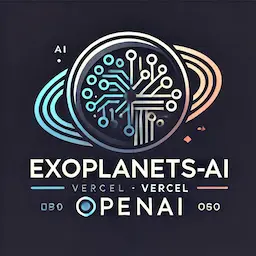

<h1 align="center">Bienvenid@s a EXOPLANETS-AI</h1>

<p align="center">
  
</p>

#### EXOPLANETS-AI simula el universo y permite la exploración de los exoplanetas en 3D a escala real con inteligencia artificial para guiar a los usuario en la exploración de los distintos cuerpos celestes y sus propiedades. EXOPLANETS-AI está impulsado por Inteligencia artificial, utiliza [Vercel AI SDK](https://sdk.vercel.ai/), conecta la API de la NASA con OpenAI y un entorno 3D.

### Datos fieles a la realidad

- **Exoplanetas**: tamaño, distancia con su estrella, velocidad de órbita, gravedad.
- **Estrellas**: tamaño

### Datos aproximados

- **Exoplanetas**: aspecto o textura, velocidad de rotación
- **Estrellas**: aspecto o textura

La API de la NASA no proporciona los datos necesarios para calcular cuantas horas tardan en rotar sobre si mismos, ni el aspecto que tienen. Por lo tanto, hemos dejado como rotación por defecto 24h. En cuanto al aspecto hemos hecho una estimación según la temperatura.

### Acciones:

El entorno 3D es sentible y reacciona modificando diferentes elementos de la escena según va evolucionando el contexto de la conversación. Hasta ahora, este es el listado de acciones que reaccionan el entorno 3D:

- Muestra un exoplaneta aleatorio de la base de datos de la NASA
- Modifica la velocidad de rotación del exoplaneta
- Aumenta la velocidad de órbita del exoplaneta alrededor de su estrella
- Ajusta cualquier parámetro del exoplaneta a su estado normal
- Muestra el exoplaneta con mayor tiempo de orbita
- Muestra el exoplaneta con menor tiempo de orbita

También hay otras acciones que NO modifican la escena pero consulta datos de la API de la NASA:

- Muestra una lista de exoplanetas
- Cuantos exoplanetas confirmados hay por la NASA
- Total de exoplanetas no confirmados por la NASA

---

## ¿Cómo puedo probarlo?

1. Visita [exoplanets-ai.vercel.app](https://exoplanets-ai.vercel.app) con Chrome.
2. Introduce tu API_KEY de OpenAI en el input que aparece en la parte superior del Chat.
3. Empieza a conversar.

## Lo quiero en local

1. Haz un git clone del proyecto

```bash
git clone https://github.com/dieg092/exoplanets-ai
```

2. Instalar todas las dependencias con el gestor de paquetes que desees

```bash
npm install
# or
yarn install
# or
pnpm i
# ...
```

3. Ejecutar el servidor en modo de desarrollo.

```bash
npm run dev
# or
yarn dev
# or
pnpm dev
# or
bun dev
```

4. Crea un fichero .env en root del proyecto con la variable API_OPENAI_KEY con tu OpenAI API_KEY o coloca tu OPEN AI - API KEY en la parte superior del chat para poder utilizar la IA .

5. Abrir localhost en el puerto asignado, por ejemplo: [http://localhost:3000](http://localhost:3000)

6. Empeiza a conversar

---

### Créditos

- **Dylan González**

  [](https://www.instagram.com/yaiir.dev/) [](https://www.linkedin.com/in/dylan-gonz%C3%A1lez-623706161/) [](https://github.com/dylanGonzalez09)

- **Diego Barranco Moliner**

  - Gmail: diegobarranco92@gmail.com
